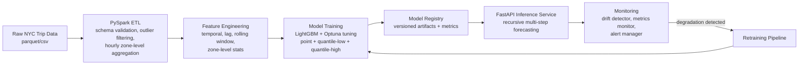

# NYC Taxi Demand Forecasting & ETL System

End-to-end forecasting system that predicts hourly taxi demand per NYC zone, up to 72 hours ahead, with uncertainty bounds — built as a full pipeline from raw trip records to a served API, not a notebook.

> **Status:** Actively being hardened for portability (see [Known Limitations](#known-limitations)). Core pipeline logic is complete and functional locally.

## What this project does

Given a zone and a horizon (1–72 hours), the system returns an hour-by-hour demand forecast with a prediction interval (low/high bound), and can also rank all 263 NYC zones by predicted demand to surface "hotspots" for a given timestamp. Predictions feed back into a monitoring loop that watches for feature drift and model degradation and can halt serving or trigger retraining.

## Architecture



## Key features

- **PySpark ETL pipeline** — schema enforcement against a required-columns contract, range-based outlier filtering (fare, distance, passenger count), timestamp-bucketed demand aggregation, and partitioned Parquet output for multi-GB raw trip data.
- **Feature engineering** — calendar features (hour, day-of-week, month, weekend/holiday, rush-hour flags), lag features (1h–168h), rolling mean/std windows, and zone-level historical demand statistics.
- **Hyperparameter-tuned LightGBM models** — point forecasts plus separate quantile-regression models (low/high) for prediction intervals, tuned with Optuna rather than fixed defaults.
- **Recursive multi-step forecasting** — the API doesn't just predict one hour out; it recursively feeds each hour's prediction back into the feature window to forecast up to 72 hours ahead per zone.
- **FastAPI serving layer** — `/forecast/{zone_id}/{hours_ahead}`, `/hotspots/{timestamp}`, and `/health` endpoints, with Pydantic request/response validation and a serving-halt switch that monitoring can flip.
- **Monitoring & retraining loop** — dedicated modules for prediction logging, feature drift detection, metrics monitoring, alerting, and an automated retraining pipeline with model versioning/registry.

## Tech stack

| Layer | Tools |
|---|---|
| ETL | PySpark, Spark SQL |
| Feature engineering | Pandas, NumPy |
| Modeling | LightGBM, Optuna, scikit-learn |
| Serving | FastAPI, Pydantic, Uvicorn |
| Monitoring/MLOps | Custom drift detection, metrics logging, model registry |
| Storage | Partitioned Parquet |
| Visualization | Plotly, Dash |

## Repository structure

```
etl/                    PySpark pipeline (load, validate, clean, aggregate, write) + feature engineering
models/                 Training (LightGBM + Optuna), evaluation, versioned model artifacts
api/                    FastAPI app, prediction service, request/response schemas
monitoring/             Drift detection, metrics monitoring, alerting, prediction logging
retraining_and_registry/  Model registry and automated retraining pipeline
dashboard/              Plotly/Dash visualization app
config/                 Central pipeline configuration
```

## Running it locally

```bash
git clone https://github.com/nickgeorgemathew/Large-Scale-Taxi-Demand-Forecasting-System.git
cd Large-Scale-Taxi-Demand-Forecasting-System
pip install -r requirements.txt

# 1. Set data/model paths for your machine in config/settings.py
# 2. Run the ETL pipeline
python etl/spark_pipeline.py

# 3. Engineer features
python etl/features/engineer.py

# 4. Train models (point + quantile)
python models/train.py

# 5. Serve predictions
uvicorn api.main:app --reload
```

## Model evaluation

Models are evaluated with MAE, RMSE, R², and SMAPE across train/val/test splits, with metrics and feature-importance plots versioned alongside each model artifact in `models/artifacts/`. *(Numbers intentionally omitted here — see the note on this in the accompanying review; re-verify and publish real, reproducible numbers before this goes in front of a recruiter.)*

## Known limitations

- Configuration currently uses hardcoded local file paths rather than environment variables — needs to be portable before someone else can run it.
- Model artifacts are versioned by timestamp in `models/artifacts/`; a full model registry UI/CLI is in progress in `retraining_and_registry/`.
- Dashboard and api is being scaffolded .

## License

MIT
